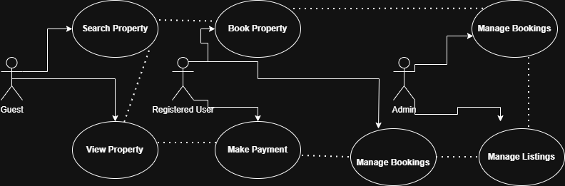

# Requirement Analysis in Software Development

## Introduction
The Requirement Analysis Project focuses on crafting a comprehensive foundation for software development by documenting, analyzing, and structuring requirements. Through a series of well-defined tasks, learners will create a detailed blueprint of the requirement analysis phase for a booking management system. This project simulates a real-world development scenario, emphasizing clarity, precision, and structure in defining requirements to set the stage for successful project execution.

## What is Requirement Analysis?
Requirement Analysis is a critical phase in the Software Development Life Cycle (SDLC) where the needs and expectations of stakeholders are identified, gathered, analyzed, and documented. This process is important because it ensures that all stakeholders have a clear and complete understanding of what the software system should do and it should perform before the design and implementation begin.

## Why is Requirement Analysis Important?
- It is important for clarity and understanding of the product to be developed
- It provides all the basis for designing and development of the product
- It gives accurate estimation of project cost, resources, and time

## Key Activities in Requirement Analysis
- Requirement Gathering: This is a key activity in Requirement Analysis where stakeholder's needs and expectations are gathered through interviews, surveys, and workshops.
- Requirement Elicitation: Involves refining and elaborating on gathered requirements through techniques like brainstorming and prototyping.
- Requirement Documentation: Is the process of creating detailed documents like requirement specifications and use cases.
- Requirement Analysis and Modeling: It means identifying and prioritizing project needs, checking if they are feasible, and creating visual diagrams to understand and plan them better.
- Requirement Validation: Is a process that requires reviewing and validating requirements with stakeholders to ensure accuracy.

## Types of Requirements

### Functional Requirements
Functional requirements specify what the system should do by describing what the system should do. They are the features and actions the system must support to fulfill user needs. Examples for a booking management project include: User authentication, property search, booking system, user registration. Key Functional Requirements:
-Search Properties: Users should be able to search for properties based on various criteria such as location, price, and availability.
-User Registration: New users should be able to create an account with personal details and login credentials.
-Property Listings: Display properties with essential details and images.
-Booking System: Users should be able to book properties, view booking details, and manage their bookings.
-User Authentication: Secure login and registration process for users.

### Non-functional Requirements
Non-functional Requirements describe how the system should perform and the qualities it must have are: Performance, security, scalability, usability, reliability. Key Non-functional Requirements:
-Performance: The system should load pages within 2 seconds and handle up to 1000 concurrent users.
-Security: Ensure data encryption, secure login, and protect against common vulnerabilities.
-Scalability: The system should be able to scale horizontally to handle increased traffic.
-Usability: The application should have an intuitive UI/UX, making it easy for users to navigate and perform tasks.
-Reliability: The system should have an uptime of 99.9% and recover quickly from any failures.

## Use Case Diagrams
Use case diagrams are visual representation of interactions between users and the system and they show how different users (actors) interact with the system to achieve specific goals (use cases). Benefits of Use Case Diagrams:
Benefits of Use Case Diagrams:
-Provide a clear visual representation of system functionalities.
-Help in identifying and organizing system requirements.
-Facilitate communication among stakeholders and development team.

The diagram below illustrates the interactions between users and the booking system.

## Acceptance Criteria
Acceptance Criteria is the conditions that a feature must meet to be accepted by as complete by stakeholders, client, or QA team.  
They define **“what success looks like”** for each feature and help ensure that everyone shares the same understanding of the expected behavior.

### Importance of Acceptance Criteria
- **Clarifies requirements:** Ensures developers and stakeholders agree on what “done” means.  
- **Improves testing:** Provides measurable outcomes that can be tested against.  
- **Prevents misunderstandings:** Reduces ambiguity in feature expectations.  
- **Supports agile workflows:** Helps teams verify that each user story delivers real value.  

### Example: Checkout Feature in the Booking Management System

#### **Feature:** Checkout

**Acceptance Criteria:**
1. The user must be able to view a summary of their selected booking before payment.  
2. The system must display the total cost, including taxes and service fees.  
3. The user must be able to choose a payment method (credit card, PayPal, or bank transfer).  
4. Payment must be securely processed, and confirmation displayed within 10 seconds.  
5. The user must receive an email receipt after successful payment.  
6. If payment fails, an appropriate error message must be shown, and the user can retry.  

---

### **Example Scenario**
**Given** a registered user has selected a property to book,  
**When** they proceed to checkout and make a payment,  
**Then** the system should confirm the booking, display a success message, and send a confirmation email.

---

### Summary
Acceptance Criteria provide a **clear definition of done**, guiding developers, testers, and stakeholders through the expected functionality and quality standards for each feature.
